# 1.3 Flutter性能监控工具


## Observatory简介

### 前言

Flutter的宣传说，使用Flutter可以达到60FPS，但是这并不意味，不管你怎么写，都能达到60FPS，如果有耗时的操作，可能会阻塞UI的渲染，如果内存使用过多，也有可能会OOM，所以性能的好坏，是保证Flutter能否达到60FPS的关键，在对Flutter进行性能优化之前，我们先看下如何来监测Flutter的性能。

### Flutter的三种构建模式(build modes)

Flutter有三种构建模式，适用于不同的场景，想要对性能监控，都跑在Profile模式下:

#### 1.Debug

顾名思义，就是调试模式，在调试模式下：

* Flutter的断言（Assertions）功能是开的

* Flutter的Observatory是开的，Observatory是用于分析和调试Dart代码的工具，用于Dart的debugger

* 扩展的服务功能（Service extensions）是开启的，如第二点的Observatory的服务还有性能的服务等。

* JIT编译模式，可以使用Hot Reload，为了快速开发

可以看到，在Debug模式下，为了debug和快速开发，牺牲了性能，所以Debug模式都是用在开发阶段。 而且模拟器只能运行Debug模式。

用命令行:

```
$flutter run

```

#### 2.Release

顾名思义，就是要发布了，在Release模式下，要追求最高的性能和最小的安装包，所以会：

* 断言（Assertions）功能关闭

* 没有Debugging的信息

* Debugger的功能关闭

* AOT编译，为了快速启动，快速执行和更小的包装包大小。

* 扩展的服务功能（Service extensions）关闭


所以，Release模式是APP要发布的时候才用。

Release模式只能跑在真机上。

```
$flutter run --release

```

或者

```

$flutter build

```


#### 3.Profile

Profile是专门监控性能的模式，在Debug模式下，不能实际反应应用的性能，而在Release模式下，却没有监控的功能，所以就诞生了Profile模式，Profile模式和Release模式更接近，Profile和Release都采用的AOT编译，所以都不能用Hot Reload，但是Profile相对于Release，多了如下的功能：

* 一些扩展的服务功能（Service extensions）是打开的，例如监控性能的浮层等。


* Tracing是打开的，Observatory也可以连接到进程


Profile模式只能跑在真机上。

用命令行:

```
$flutter run --profile

```

### 使用Observatory来监控性能

Observatory是用于分析和调试Dart代码的工具，因为Flutter自带Dart VM，所以也可以用Observatory。

#### 1. 命令行启动 Observatory

Debug下启用Observatory：

```
$flutter run

```

Profile下启用Observatory：

```
$flutter run --profile

```

运行完命令后，会看到如下的信息：

```

$ flutter run --profile
Initializing gradle...                                       0.8s
Resolving dependencies...                                    6.6s
Launching lib/main.dart on ALP AL00 in profile mode...
Gradle task 'assembleProfile'...
Gradle task 'assembleProfile'... Done                       21.2s
Built build/app/outputs/apk/profile/app-profile.apk (66.5MB).
Installing build/app/outputs/apk/app.apk...                  5.4s
D/mali_winsys(18612): EGLint new_window_surface(egl_winsys_display *, void *, EGLSurface, EGLConfig, egl_winsys_surface **, EGLBoolean) returns 0x3000

An Observatory debugger and profiler on ALP AL00 is available at http://127.0.0.1:57535/
For a more detailed help message, press "h". To quit, press "q".
复

```

#### 打开``http://127.0.0.1:57535/``这个网址 是Observatory的主页面：

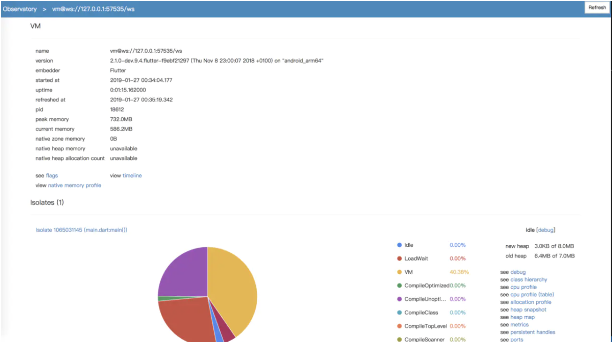

Observatory支持如下的功能：

* Allocation Profile

* Code Coverage

* CPU Profile

* Debugger

* Evaluating Expressions

* Heap Map

* Isolate

* Metrics

* User and VM Tags


##### 最上面的蓝色导航栏
表示当前所在的位置

###### 1. vm@ws://127.0.0.1:50579/ws ：表示当前连接的VM

鼠标放在这个上面，会看到这个，表示当前APP的main()：
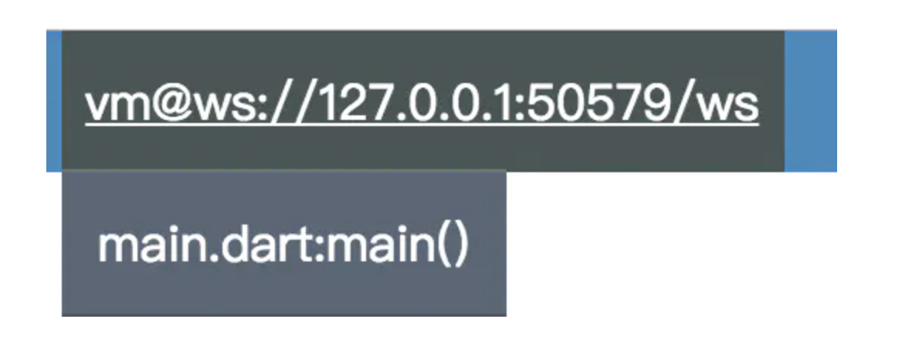

###### 2. 右边的Refresh ：刷新数据

##### VM 显示当前VM的信息

* name ： 当前VM的名字

* version ：Dart的版本，APP build的时间，运行在哪个平台上

* embedder ：嵌入的平台

* started at ：VM启动时的时间戳

* uptime ：VM已运行的时长

* refreshed at ：上次采样数据的时间

* pid ： 进程ID

* peak memory ：APP运行时用的峰值内存

* current memory : APP当前用的内存

* native zone memory ：native 原生内存

* native heap memory ：native 堆内存

* native heap allocatioon count ： native 堆对象数量

* flag ：一些标记位

* timeline ：工具

* native memory profile 


##### Isolates

这里是显示APP里的Isolates，每个APP都有一个root Isolates。

Isolates是用一个饼图显示，这个饼图有很多组成部分，我们把这些叫做tags，这些tags用来代表在VM里不同的执行列表，包括User TAG 和 VM TAG：

###### 1. User TAG

用户自定义的TAG，使用方式如下：

```
import 'dart:developer';

var customTag = new UserTag('MyTag');

// Save the previous tag when installing the custom tag.
var previousTag = customTag.makeCurrent();

// your code here

// Restore the previous tag.
previousTag.makeCurrent();

```

###### 2. VM TAG

VM TAG是系统定义的，在整个UI中使用，有：

* CompileOptimized, CompileScanner, CompileTopLevel, CompileUnoptimized ：编译Dart代码

* GCNewSpace ： 新生代的垃圾收集

* GCOldSpace ： 老生代的垃圾收集

* Idle ： 不是VM TAG，但是用来标识Isolate空闲的占比

* Native ： 执行Native代码，dart：io库使用的C ++代码 或者 平台相关代码(Platform Channel)

* Runtime : 执行 Runtime 代码

* Dart ： 执行 自己的业务Dart 代码

* VM ：创建isolate，和其他未被覆盖的部分


##### debug

> 可以设置断点并调试您的应用程序。
> 
> [如何设置debugger，看 dart-lang.github.io/observatory…](https://dart-lang.github.io/observatory/debugger.html)


		
##### class hierarchy

> 显示应用程序的类层次结构。
> 
> 

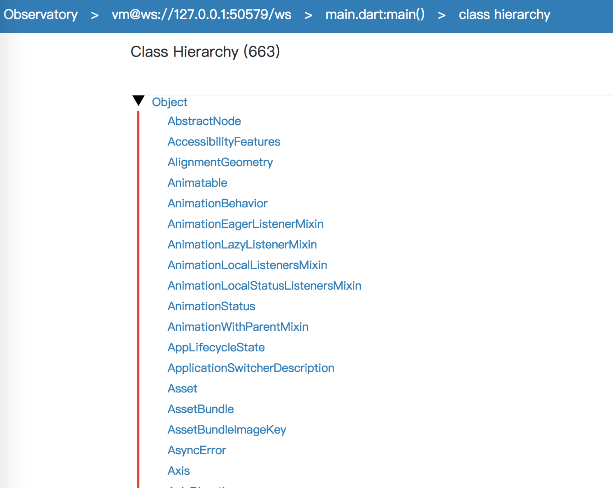


##### cpu profile

> 显示当前isolate的CPU使用数据
> 
> 

图表的下部按cpu占用比例做了一个列表，反映的是函数的调用次数和执行时间（划重点）。一般排在前面的函数（这些函数是？有待学习）都不是我们写的dart代码。如果你发现自己的某个函数调用占比反常，那么可能存在问题。
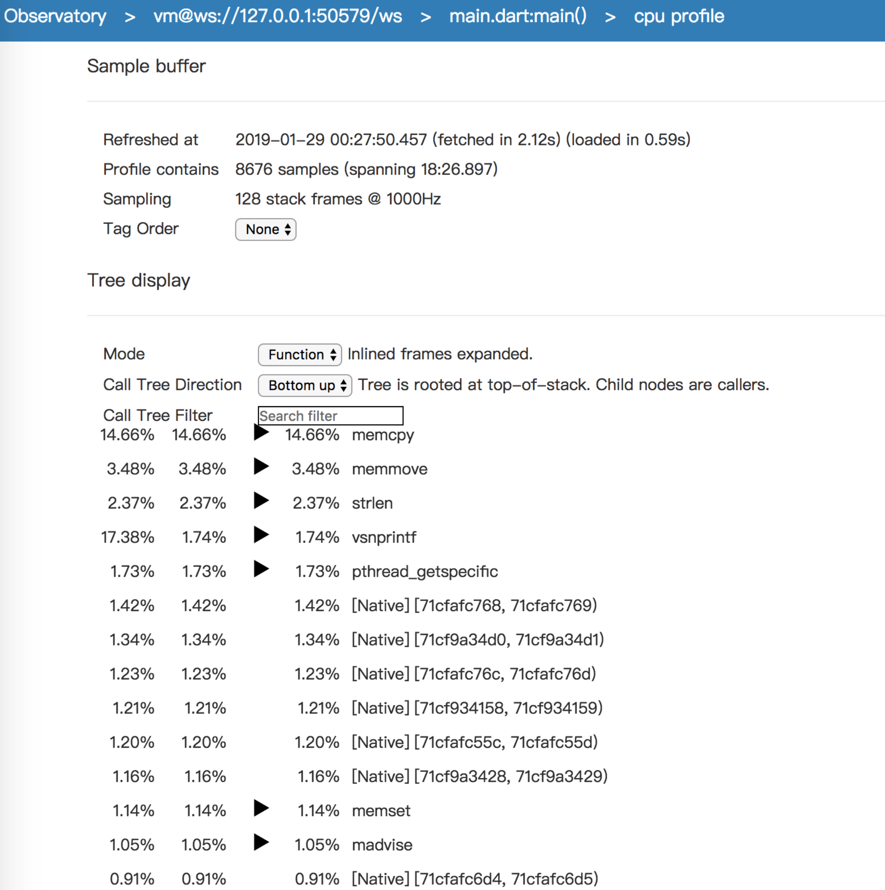
[具体使用的地址：dart-lang.github.io/observatory…](https://dart-lang.github.io/observatory/cpu-profile.html)


##### cpu profile (table)

> 和cpu profile一样，但是是以表格的形式来展示
> 
> 


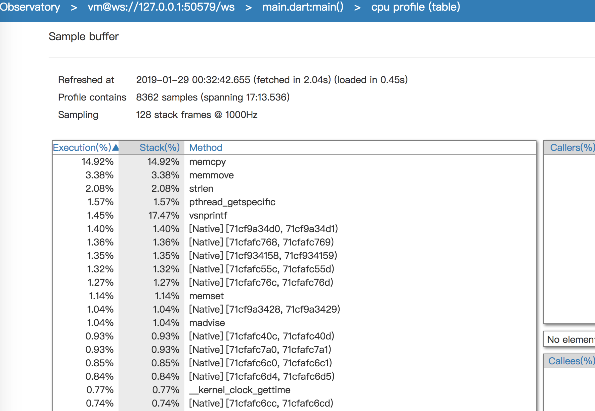

##### allocation profile

> 显示isolate已分配的内存。通过这个面板你能看到新生代/老生代的内存大小和占比；每个类型所占用的内存大小。
> 
> 


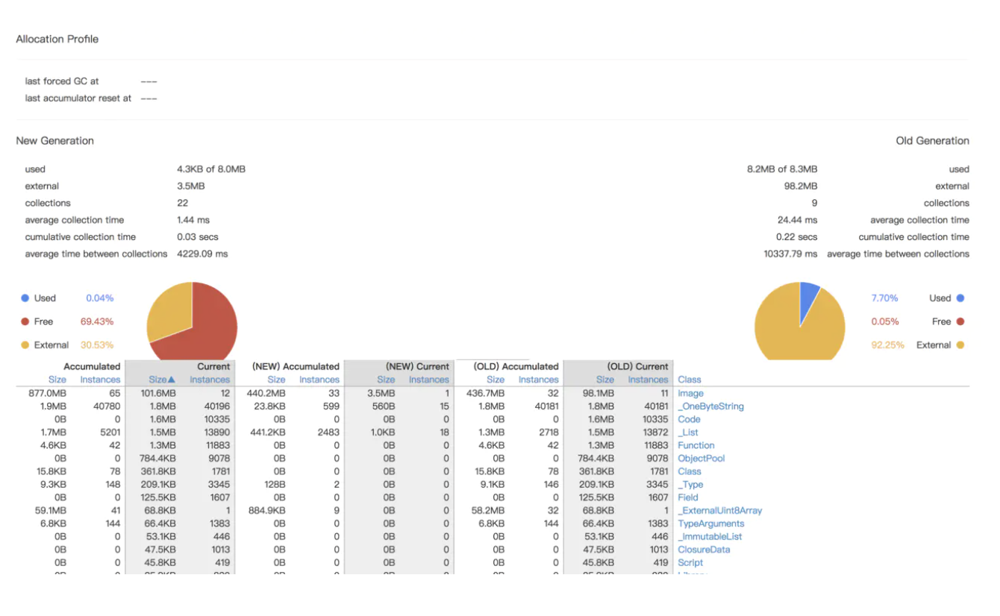

**Heap 堆**，动态分配的Dart对象所在的内存空间

**New generation**: 新创建的对象，一般来说对象比较小，生命周期短，如local 变量。在这里GC活动频繁
Old generation：从GC中存活下来的New generation将会提拔到老生代Old generation，它比新生代空间大，更适合大的对象和生命周期长的对象

通过这个面板你能看到新生代/老生代的内存大小和占比；每个类型所占用的内存大小。

为了debug的方便，我们可以获取到某段时间的内存分配情况：点击Reset Accumulator按钮，把数据清零，执行一下要测试的程序，点击刷新。
为了检查内存泄露，我们可以点击GC按钮，手动执行GC。

**Accumulator Size**:自点击Reset Accumulator以来，累加对象占用内存大小
**Accumulator Instances**：自点击Reset Accumulator以来，累加实例个数
**Current Size**：当前对象占用内存大小
**Current Instances**：当前对象数量


[具体使用的地址：dart-lang.github.io/observatory…](https://dart-lang.github.io/observatory/allocation-profile.html)

##### heap snapshot

> 堆快照
> 


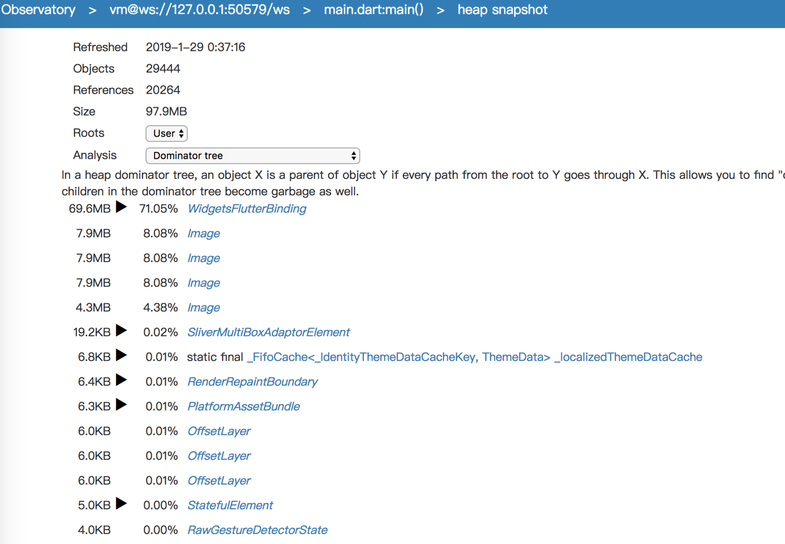

##### heap map

> 将分配的内存显示为颜色块
> 

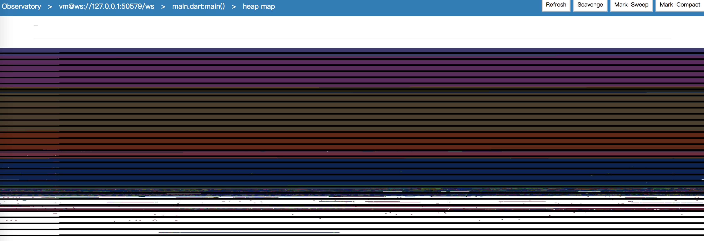

heap map 面板能查看old generation中的内存状态
它以颜色显示内存块。 每个内存页面(page of memory)为256 KB，每页由水平黑线分隔。 像素的颜色表示对象的类ID - 例如，蓝色表示字符串，绿色表示双精度表。 可用空间为白色，指令（代码）为紫色。 如果启动垃圾收集（使用“分配配置文件”屏幕中的GC按钮），堆映射中将显示更多空白区域（可用空间）。
将光标悬停在上面时，顶部的状态栏显示有关光标下像素所代表的对象的信息。 显示的信息包括该对象的类型，大小和地址。
当你看到白色区域中有很多分散的其它颜色，说明存在内存碎片化，可能是内存泄露导致的。

[具体使用看：dart-lang.github.io/observatory…]()

##### metrics

> 包含您应用中收集的指标。
> 
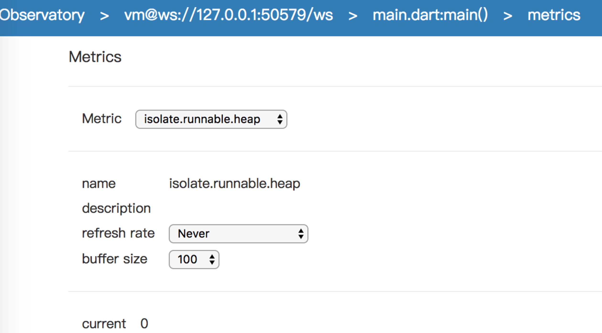

##### persistent handles

> 查看强对象和若对象
> 

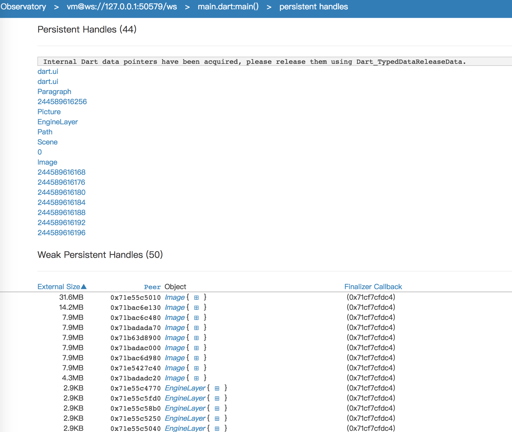


##### ports

> 端口

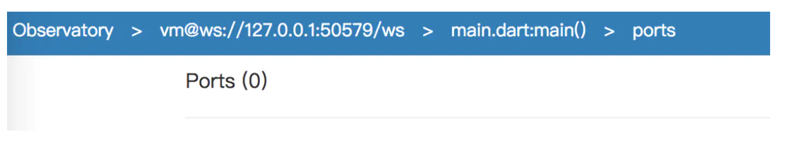


##### logging

> 设置Log的级别
> 

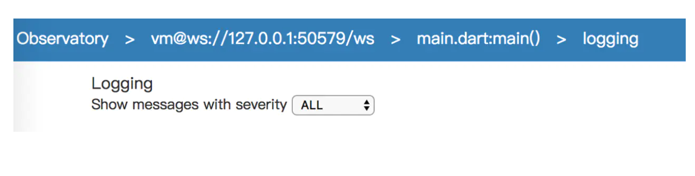


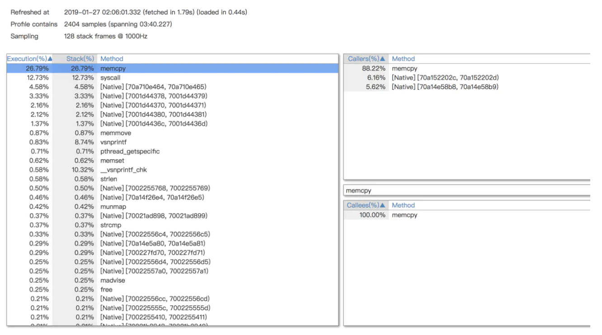

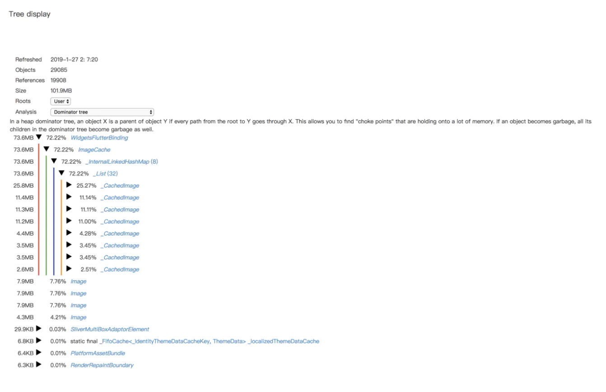


#### 2.Flutter Inspector启动

Flutter Inspector是一个强大的工具，要想使用Flutter Inspector，就得先运行Flutter APP。


运行Flutter APP后:


##### 在Android Studio里

选择 View > Tool Windows > Flutter Inspector，就可以打开Flutter Inspector，可以看到有很多功能，如下图：

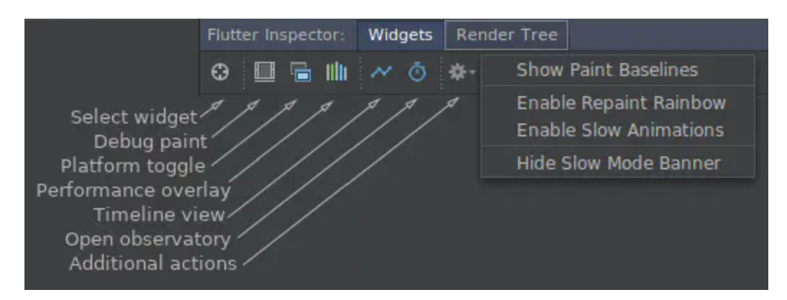

然后选择Open observatory。


#### 在VS Code里

通过 View > Command Palette 或者 cmd+p打开命令板，输入``Open observatory``然后选择 Open observatory就行。

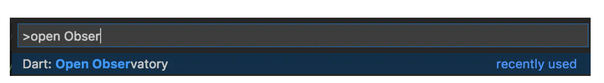

如果看不到，说明你没有运行Flutter APP，得以``Start Debugging``的方式运行。


## PerformanceOverlay简介

PerformanceOverlay是在app上显示性能统计数据的浮窗。PerformanceOverlay是一个Widget，有几个属性，用于控制开启哪些功能。

###  PerformanceOverlay 分析

PerformanceOverlay的源码是：

```
~/flutter/packages/flutter/lib/src/widgets/performance_overlay.dart

```

可以看出PerformanceOverlay有以下的属性：


* final int optionsMask ：用于标记哪些功能打开的flag，有四个标志位，

* displayRasterizerStatistics ：显示光栅化器统计信息（GPU） 

* visualizeRasterizerStatistics ：可视化光栅化器统计信息(GPU) 

* displayEngineStatistics ：显示引擎统计（CPU） 

* visualizeEngineStatistics ：可视化引擎统计（CPU）

* displayRasterizerStatistics ：显示光栅化器统计信息（GPU） 

* visualizeRasterizerStatistics ：可视化光栅化器统计信息(GPU) 

* displayEngineStatistics ：显示引擎统计（CPU） 

* visualizeEngineStatistics ：可视化引擎统计（CPU）


### 启用 PerformanceOverlay

开启Performance Overlay的方法有三种：

#### 1、 Flutter Inspector

Flutter Inspector是一个强大的工具，Performance Overlay的功能也集成在Flutter Inspector里。

需要我们运行Flutter APP后才可以使用，


###### 在Android Studio里

选择 View > Tool Windows > Flutter Inspector，就可以打开Flutter Inspector，可以看到有很多功能，然后选择Performance Overlay。

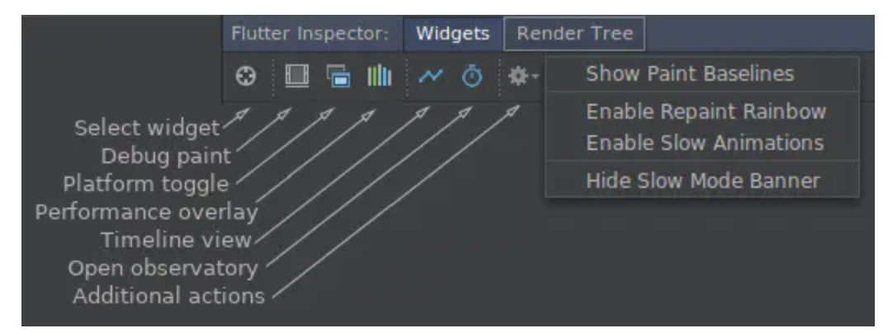

##### 在VS Code里

通过 View > Command Palette 或者 cmd+p打开命令板，输入“performance” 然后选择 Toggle Performance Overlay 就行。


##### 2. 使用代码设置

我们知道PerformanceOverlay是一个widget，PerformanceOverlay是在WidgetsApp里被使用的，MaterialApp又使用了WidgetsApp，所以我们通过给MaterialApp 或者 WidgetsApp 设置参数来控制PerformanceOverlay的功能。


所以为了，开启将PerformanceOverlay，要将MaterialApp 或者 WidgetsApp 的showPerformanceOverlay 属性设置为true，如下：


```
class MyApp extends StatelessWidget {
  @override
  Widget build(BuildContext context) {
    return MaterialApp(
      showPerformanceOverlay: true,
      title: 'My Awesome App',
      theme: ThemeData(
        primarySwatch: Colors.blue,
      ),
      home: MyHomePage(title: 'My Awesome App'),
    );
  }
}


```

### PerformanceOverlay：GPU、CPU统计信息

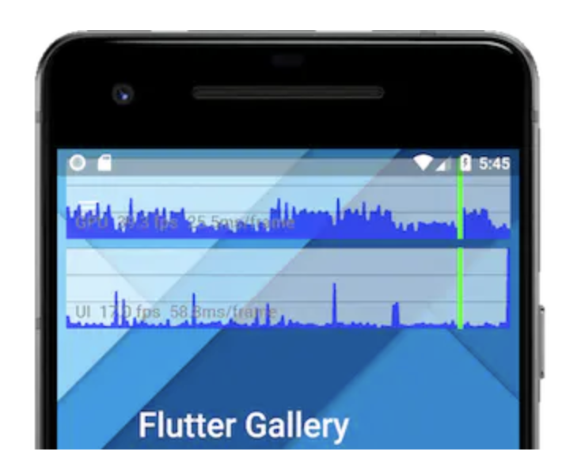
这个浮窗有两个图形：

##### 1. 上面的是GPU thread

表示在GPU线程上生成每帧需要的时间。

##### 2.下面的UI thread

表示在UI线程上生成每帧需要的时间。

##### 3. 纵轴

图中的纵轴代表时间，每个图形都被分成三格，每小隔代表16ms，如果图中超过这三条线之一，那么您的运行频率低于60Hz。


##### 4.横轴

横轴代表帧。 该图仅在应用程序绘制时更新，因此如果它处于空闲状态，该图将停止移动。每个图形绘制的都是该线程最后300帧的数据。


为了保证60FPS，每帧耗费的时间应该是小于16ms的，看上图中绿色的粗线条，代表的是当前帧的数据，如果当前帧的数据符合预期（<16ms），那么就是绿色的，如果不符合，就是红色的

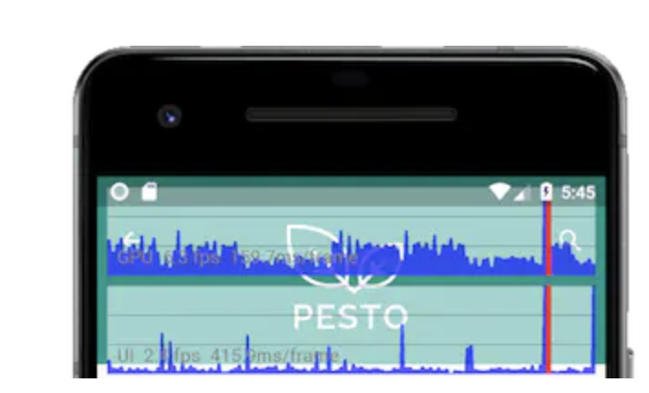

遇到红色的就需要去具体分析，因为会造成APP卡顿：

###### 1. 如果GPU thread是红色的


那么可能是绘制的图形过于复杂，或者是执行了过多的GPU操作。


###### 2. 如果UI thread是红色的

说明肯定是Dart代码里有耗时操作，导致阻塞了UI操作。

###### 3. 如果两个都是红色的 建议从UI thread，也就是Dart代码查起。


### GPU问题定位

辅助定位GPU问题的，就是PerformanceOverlay的下面两个功能：

#### 1. PerformanceOverlay：checkerboardRasterCacheImages -- 检查缓存图片的情况

还有一个拖慢GPU渲染速度的是没有给静态图像做缓存，导致每次build都会重新绘制。我们可以把静态图像加到RepaintBoundry中，引擎会自动判断图像是否复杂到需要repaint boundary。

#### 2. PerformanceOverlay：checkerboardOffscreenLayers -- 检查不必要的setlayer

setlayer是Canvas里的操作，非常耗性能，所以要尽量避免这个操作。你可能会好奇，我根本没用到这个，是的，我们一般是不会使用这个函数的，所以当你开启了这个检查后，会发现啥也没有，正好说明了你没有用到setlayer。我们一般都是被动的使用，比如需要剪切、透明的操作，用到一些widget的时候，这些widget会用到setlayer方法，一旦遇到这种情况，我们要想一下是否一定要这么做，能不能通过其他方式实现。

开启这两个功能的方法：

```
MaterialApp(
    showPerformanceOverlay: true,
    checkerboardOffscreenLayers: true, //使用了saveLayer的图像会显示为棋盘格式并随着页面刷新而闪烁
    checkerboardRasterCacheImages: true, // 做了缓存的静态图像图片在刷新页面使不会改变棋盘格的颜色；如果棋盘格颜色变了，说明被重新缓存，这是我们要避免的
    ...
);


```

### GPU优化 tip

#### 1. 一些效果尽量设置在子Widget上，而不是父Widget

例如，要实现一个混合图层的半透明效果，如果把透明度设置在顶层Widget上，CPU会把每个子Widget的图层渲染出来，在执行saveLayer操作保存为一个图层，最后给这个图层设置透明度，但是saveLayer的开销很大，所以官方给出建议：首先确认这些效果是否真的有必要；如果有必要，应该把透明度设置到每个子Widget上，而不是父Widget。裁剪操作也是类似。

#### 2. UI问题定位

可以使用 Observatory里的timeline的功能分析。


## UI优化 tip

* 介绍应用流畅性的检测和优化策略

* 介绍内存的检测和优化策略

* 介绍性能优化证明的意义和流程

* 介绍性能检测工具 Observatory 的基础使用

### 流畅性

App 流畅性的关键指标有 UI帧率，GPU帧率，我们期望它能达到 60fps，也就是16ms每帧。


#### 一 以 profile / release 模式运行

为了获取最接近生产环境的数据，我们应该选择一台尽可能低端的真机，并且以 profile 模式或者 release 模式下运行app。

> 1. 因为 debug 模式会有一些额外的检查工作，比如``assert()``等
>
> 2. 为了加速开发效率，debug 模式是以 ``JIT（Just in time）``模式编译 dart 代码的，而 profile 和 release 是提前编译为机器码`` AOT（Ahead Of Time）``，所以 debug 会慢很多
>
>


* 在 Android Studio and IntelliJ 中, 在菜单栏中点击`` Run > Flutter Run main.dart in Profile Mode``


* VS Code：打开 launch.json 文件并设置flutterMode 为 profile:

```
"configurations": [
	{
		"name": "Flutter",
		"request": "launch",
		"type": "dart",
		"flutterMode": "profile" # 测试完后记得把它改回去！
	}
]

```

* 用命令行启动:

```
$ flutter run --profile

```


#### 检测帧率

那么检测帧率有哪些方法呢？Flutter 给我们提供了 ``Performance Overlay`` 三种开启方式


* 在Android Studio 和 IntelliJ IDEA中： 选中 ``View > Tool Windows > Flutter Inspector. ``点击下面这个按钮。

* 在 VS Code中
选中 ``View > Command Palette…`` 会显示一个 command 面板.
在命令面板中输入 ``performance ``并选择 ``Toggle Performance Overlay`` 如果命令显示为不可用，需要检查 app 是否正在运行.

* 代码中打开 在MaterialApp 或者 WidgetsApp的构造函数中设置showPerformanceOverlay 属性为 true :

```
class MyApp extends StatelessWidget {
  @override
  Widget build(BuildContext context) {
    return MaterialApp(
      showPerformanceOverlay: true, // 开启
      title: 'My Awesome App',
      home: MyHomePage(title: 'My Awesome App'),
    );
  }
}

```


然后就是动手操作 app，并观察图表上是否出现红色线条。绿色代表当前帧，当页面有变动，图表会不断绘制。蒙版上有2个图表，每个图表上有三横格，每个横格代表16ms。如果大多数帧都在第一格，说明达到了期望的帧率。

图表分别体现了 UI帧率 和 GPU帧率。如果出现了红色，说明对应的线程有太多work要做。那先来了解一下 Flutter 中的4个主要线程分别承担了什么职责。

* Platform线程：插件代码运行的线程；即Android/iOS的主线程，

* UI线程：在Dart虚拟机中执行Dart代码。作用是创建视图树，然后将它发送给GPU。注意不要阻塞此线程！

* GPU线程：把上面提到的视图树渲染出来，虽然我们在flutter中不能直接访问GPU线程和数据，但是Dart代码可能导致此线程变慢

* I/O线程：执行比较耗时的任务


在运行app的过程中，观察爆红的地方和触发场景，进行分析。

#### 分析思路

##### 1. 如果是UI报红：那么可能是执行了某个较耗时的函数？或者函数调用过多？算法复杂度高？

##### 2. 如果只是 GPU 报红：那么可能是要绘制的图形过于复杂？或者执行了过多GPU操作？

* 比如要实现一个混合图层的半透明效果：如果把透明度设置在顶层控件上，CPU会把每个子控件图层渲染出来，再执行saveLayer操作保存为一个图层，最后给这个图层设置透明度。而saveLayer开销很大，这里官方给出了一个建议：首先确认这些效果是否真的有必要；如果有必要，我们可以把透明度设置到每个子控件上，而不是父控件。裁剪操作也是类似。

* 还有一个拖慢GPU渲染速度的是没有给静态图像做缓存，导致每次build都会重新绘制。我们可以把静态图形加到RepaintBoundry控件中，引擎会自动判断图像是否复杂到需要用repaint boundary，不需要的话也会忽略。

* 开启saveLayer和图形缓存的检查

```
MaterialApp(
    showPerformanceOverlay: true,
    checkerboardOffscreenLayers: true, // 使用了saveLayer的图形会显示为棋盘格式并随着页面刷新而闪烁
    checkerboardRasterCacheImages: true, // 做了缓存的静态图片在刷新页面时不会改变棋盘格的颜色；如果棋盘格颜色变了说明被重新缓存了，这是我们要避免的
    ...
);

```

#### 提高流畅性的策略

* 代码调用时机是否可以延后？如底部导航栏式的页面，没有必要第一次进入就把每个子Page都创建出来 -- 懒加载

* 尽量做到局部刷新

* 把耗时的计算放到独立的isolate去执行

* 检查不必要的 saveLayer

* 检查静态图片是否添加缓存

* [relayout boundary](https://juejin.im/post/5c0fc3cb5188251da07e09b3#heading-8)

*  [repaint boundary](https://juejin.im/post/5c0fc3cb5188251da07e09b3#heading-12)


